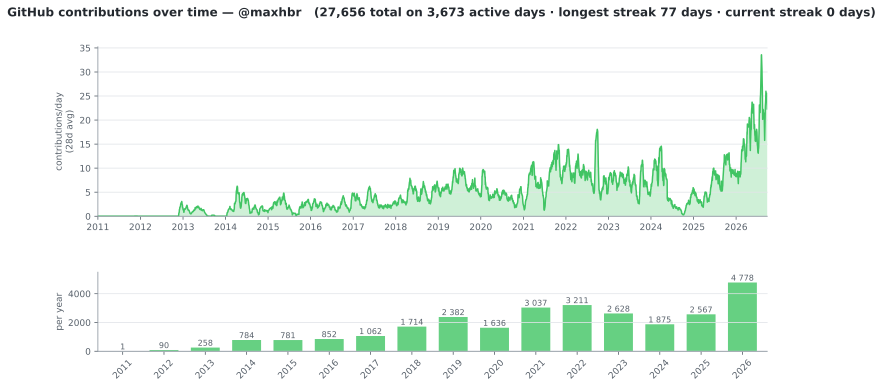
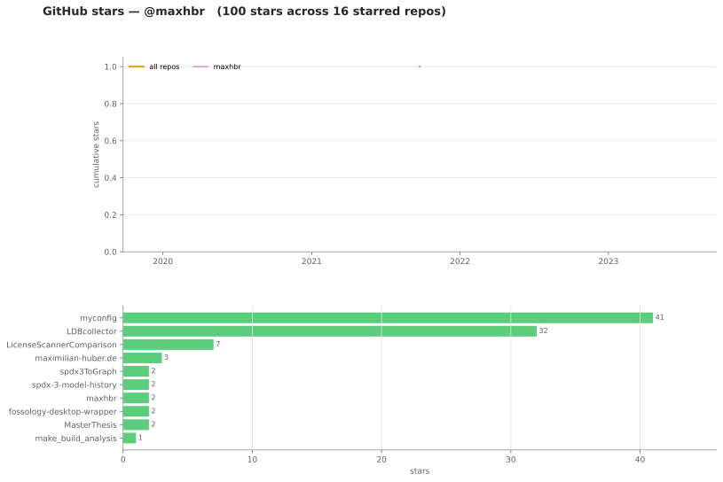

*** Open Source License Compliance
- https://github.com/maxhbr/LDBcollector
- https://github.com/maxhbr/yacp
- https://github.com/maxhbr/stats-on-cd-cd
*** NixOS
- my dotfiles: https://github.com/maxhbr/myconfig
- my wallpapers: https://github.com/maxhbr/wallpapers
*** Haskell
- my scripting to align and stack macros: https://github.com/maxhbr/myphoto
*** Embedded
- a template for starting zephyr projects: https://github.com/maxhbr/zephyr-template
- my zephyr stuff: https://github.com/maxhbr/my-zephyr-workspace
*** Photograpy
- my homepage: https://github.com/maxhbr/maximilian-huber.de
  - https://maximilian-huber.de
*** My GitHub stats
These charts refresh nightly via [[file:.github/workflows/update-profile.yml][a GitHub Action]].

**** Contributions over time

**** Repository stars

Generated by [[file:scripts/contributions.py]] and [[file:scripts/repo_stars.py]].
To update locally:
#+begin_src sh
  ./scripts/contributions.py all --login maxhbr
  ./scripts/repo_stars.py     all --login maxhbr
#+end_src

The token comes from ~$GITHUB_TOKEN~ or ~pass show Account/github-token~
(a classic PAT without scopes is enough for public data).
